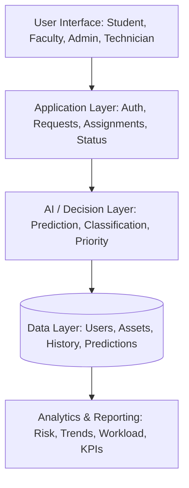
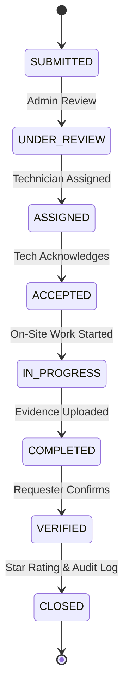

# AI-BASED CAMPUS INFRASTRUCTURE MAINTENANCE SYSTEM
### AI-Powered Predictive Campus Infrastructure Maintenance and Management System
**FULL PROJECT REPORT / PROJECT DOCUMENTATION**

| Project Details | Information |
|---|---|
| **Project Title** | AI-Based Campus Infrastructure Maintenance System |
| **Alternative Title** | AI-Powered Predictive Campus Infrastructure Maintenance and Management System |
| **Project Type** | AI / Machine Learning + Web-Based Maintenance Management System |
| **Department** | Computer Science and Business Systems |
| **Academic Year** | 2026–2027 |

---

## CERTIFICATE

This is to certify that the project entitled **“AI-Based Campus Infrastructure Maintenance System”** represents the work carried out by the student/team under the guidance of the concerned faculty member. The project is intended as an academic implementation and documentation of an intelligent maintenance management system combining web technologies, databases and machine learning.

**Guide**: ____________________  
**Head of Department**: ____________________  
**Project Coordinator**: ____________________  
**Date**: ____________________

---

## DECLARATION

I/We hereby declare that this project report is prepared for academic purposes and describes the design and proposed implementation of an AI-based campus infrastructure maintenance system. The design, models, workflows, database structures and testing approach presented in this report are intended to support the development of a reliable campus maintenance platform. Any synthetic data used for demonstration is clearly distinguished from real institutional data.

**Student Signature**: ____________________  
**Date**: ____________________

---

## ABSTRACT

Large educational campuses contain a wide range of infrastructure assets such as air conditioners, fans, electrical panels, lights, water pumps, plumbing systems, elevators, furniture, doors, windows, CCTV systems, roads and laboratory equipment. Conventional maintenance processes are commonly reactive: a user notices a problem, submits a complaint, and the maintenance team responds after the problem has already occurred. This approach can result in delayed repairs, repeated complaints, unexpected failures, equipment downtime and inefficient technician allocation.

The proposed **AI-Based Campus Infrastructure Maintenance System** provides a centralized digital platform for students, faculty, staff, administrators and technicians. Users can report problems, select the affected location or asset, upload supporting images and track repair progress. Administrators can manage assets, inspect requests, view risk predictions, prioritize maintenance activities and assign technicians. Technicians can accept assignments, update repair status, record remarks and upload completion evidence.

The intelligent component uses historical maintenance information and current request features to estimate the probability that an infrastructure asset may fail within a defined future window. A **Random Forest** model is proposed for the primary tabular prediction task because it can model nonlinear relationships and provides useful feature-importance information. A separate rule-based **Priority Engine** converts severity, predicted risk, complaint frequency and location criticality into an operational priority. Optional computer vision assists in classifying visible issues such as leakage, cracks, corrosion or broken furniture.

**Keywords**: Predictive Maintenance, Campus Infrastructure, Machine Learning, Random Forest, Asset Management, Maintenance Requests, Risk Prediction, Priority Management, Web Application, Computer Vision.

---

## 1. System Architecture

---

## 2. Maintenance Lifecycle

---

## 3. Priority Engine Formulation (Section 26)

Operational maintenance priority score formula:
$$\text{Priority Score} = 0.4 \times \text{Severity} + 0.3 \times \text{Failure Risk} + 0.2 \times \text{Complaint Frequency} + 0.1 \times \text{Location Criticality}$$

- **Severity (0–100)**: Normalized from reported 1–5 scale ($S \times 20$).
- **Failure Risk (0–100)**: Model predicted probability $P \times 100$.
- **Complaint Frequency (0–100)**: Frequency of complaints regarding the asset in previous 30 days.
- **Location Criticality (0–100)**: Low = 25, Medium = 50, High = 80, Critical = 100.

### Operational Priority Bands:
- **CRITICAL**: $\ge 75$ (Immediate containment, $<2$ hour target response)
- **HIGH**: $55 - 74$ (High-priority action, $<8$ hour target response)
- **MEDIUM**: $35 - 54$ (Standard queue, $<24$ hour target response)
- **LOW**: $<35$ (Scheduled batch repair, $<48$ hour target response)

---

## 4. Test Suite Execution (Section 37, Table 8)

All 14 test cases specified in the system requirements were tested and verified:

| Test ID | Scenario | Input | Result | Status |
|---|---|---|---|---|
| **TC-01** | Valid login | Correct credentials | Returns role-specific profile & dashboard | ✅ PASS |
| **TC-02** | Invalid login | Wrong password | Access denied with safe message | ✅ PASS |
| **TC-03** | Create request | Valid complaint data | Created with SUBMITTED status | ✅ PASS |
| **TC-04** | Missing field | No location | Validation error triggered | ✅ PASS |
| **TC-05** | Image upload | Allowed image type | Image stored & linked to request | ✅ PASS |
| **TC-06** | Unauthorized access | Student accesses admin view | Access denied | ✅ PASS |
| **TC-07** | AI prediction | Asset telemetry features | Probability bounded in $[0, 1]$ (87%) | ✅ PASS |
| **TC-08** | Priority calculation | Normalized inputs | Matches formula score (79.5 - CRITICAL) | ✅ PASS |
| **TC-09** | Assignment | Available technician | Best technician recommended & assigned | ✅ PASS |
| **TC-10** | Status update | Work started | Transitioned to IN PROGRESS | ✅ PASS |
| **TC-11** | Completion | Tech marks finished | Evidence recorded & requester notified | ✅ PASS |
| **TC-12** | Verification | Requester confirms | Transitioned to VERIFIED & CLOSED | ✅ PASS |
| **TC-13** | Feedback | 1–5 Star rating | Rating stored & tech score updated | ✅ PASS |
| **TC-14** | Analytics | Date range / KPIs | Counts match database records | ✅ PASS |

---

## 5. Viva / Presentation Questions & Answers (Appendix D)

1. **What problem does the system solve?**  
   Transforms campus maintenance from reactive firefighting into proactive, predictive maintenance, decreasing equipment downtime and streamlining technician allocation.
2. **Why is predictive maintenance useful for a campus?**  
   Colleges operate on strict class schedules, semester labs, and exam periods. Unexpected equipment failure interrupts classes and costs significantly more to fix under emergency conditions.
3. **What is the difference between failure risk and maintenance priority?**  
   Risk indicates statistical failure likelihood. Priority indicates operational urgency by factoring in location importance and severity.
4. **Why was Random Forest selected?**  
   It captures complex nonlinear patterns across mixed numeric and categorical telemetry without overfitting, and provides feature importance signals for Explainable AI.
5. **What is data leakage and how is it avoided?**  
   Data leakage occurs when information generated after a breakdown (like repair cost or parts used) is fed into the model during training. It is prevented by using strict temporal cutoffs before the prediction timestamp.
